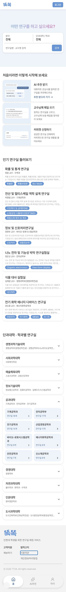
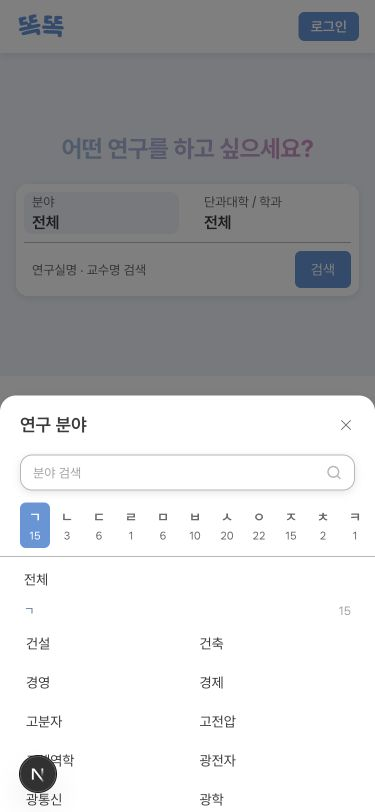
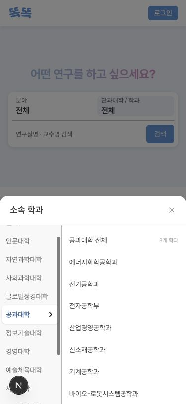

# 모바일 홈 (TTOK-76)

## 디자인 대응

| 영역 | 확인한 Node |
| --- | --- |
| 홈 기본 프레임 | 2874:7644 |
| 검색 Hero / 검색 박스 | 2874:7646 / 2874:7649 |
| 서비스 안내 / 연구실 카드 | 2874:7667 / 2874:7738 |
| 학과 아코디언 / 타일 | 2874:7744 / 2874:7754 |
| 모바일 Footer / 하단 메뉴 | 2874:7867 / 2874:7881 |
| 학과 선택 상태 / 바텀시트 | 2874:7966 / 2874:8287 |
| 분야 선택 상태 | 2881:8799 / 2881:9336 |

375px에서는 Hero 323px, 검색 박스 112px, 서비스 미리보기 40% 배율과 단과대·학과 2열 배치를 반영한다. 320px에서는 텍스트를 줄바꿈하고 타일 너비를 가용 너비에 맞춘다. Footer에는 하단 메뉴와 safe area를 위한 여백을 둔다.

## 검색과 데이터

- 모바일 검색은 `HomeSearchField`의 조건·검증·URL 생성을 재사용한다. 홈 카드 목록을 프론트에서 필터링하지 않는다.
- 분야·단과대학/학과의 전체 값은 빈 조건으로 표현한다. 검색어도 비어 있으면 검색 버튼으로 `/search`에 이동해 전체 검색 API를 호출한다.
- 단과대 전체를 고르면 `college`, 학과를 고르면 `department`를 전달한다. 분야와 검색어를 함께 전달할 수 있다.
- 선택 시 시트를 닫고 트리거에 포커스를 반환한다. Escape, 닫기 버튼, 배경 클릭을 지원하며 모바일 시트의 Tab 포커스와 배경 스크롤을 제한한다.
- 분야 시트는 열릴 때 닫기 버튼에 포커스를 두어 모바일 키보드가 자동으로 열리지 않게 한다. 검색 입력은 사용자가 선택한다.
- 홈은 기존 조회 결과 최대 6개를 표시한다. Figma의 ‘인기 연구실’ 제목은 유지하지만 신규 인기순 산정은 추가하지 않는다.
- 학과 아코디언은 기존 학과별 개수 조회를 재사용한다. 공과대학이 있으면 초기 펼침 대상으로 사용하고, 없으면 첫 단과대를 펼친다. 단과대·학과 순서는 기존 데이터 순서를 따른다.
- AI 추천 안내는 기존 `/recommendations`에 연결한다. 메일·커피챗 미리보기는 서비스 설명이며 새로운 생성·신청 기능은 아니다.
- Footer 정책 링크는 실제 페이지에 연결한다. 제보 링크는 존재하지 않는 `/report` 대신 정책 문서의 공개 문의 이메일을 사용한다.

## 후속 범위

별도 전체 보기 버튼을 추가하지 않는다. 검색 결과의 페이지네이션·무한 스크롤 변경은 TTOK-77에서 진행하며 기존 결과 페이지 이동은 유지한다.

## 검증

- 375px·320px 홈: 가로 넘침 없음, 연구실 최대 6개, Footer·하단 메뉴 배치 확인.
- 실제 빈 검색: `/search` 이동 및 서버 전체 231개 결과 표시 확인.
- 실제 분야·학과 조합: 조건 URL 보존 및 검색 결과 확인.
- 실제 기계공학과 타일: 조건 URL 이동 및 18개 결과 확인.
- Storybook: 전체 검색, 복합 조건·초기화, 아코디언 펼침·접기, 시트 닫기·Escape·포커스 복귀 및 기존 데스크톱 키보드 선택 검증.
- 기존 Node 테스트 22개 통과. 최종 코드의 lint, Next.js 빌드, Storybook 빌드를 실행한다.

